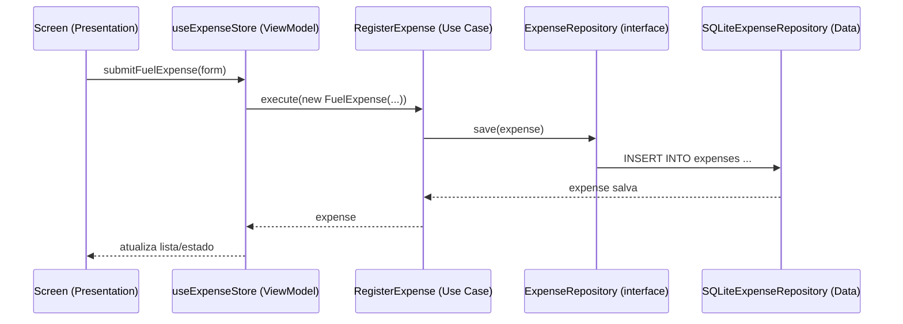

# Arquitetura — AutoMobile

## Estilo arquitetural

**Offline-First** com separação em camadas inspirada em **MVVM** e em
Clean Architecture "leve" (regras de negócio isoladas de framework/UI):

```
Presentation (Screens/Components)
        |
   ViewModel (Zustand stores)
        |
     Domain (Entities + Use Cases + Repository Interfaces)
        |
      Data (SQLite Repository Implementations)
```

- **Domain** não conhece React Native, Expo nem SQLite — só regras de
  negócio e interfaces (portas). É a camada testável e estável.
- **Data** implementa as interfaces do Domain usando SQLite
  (`expo-sqlite`), permitindo trocar o storage no futuro sem tocar em
  regra de negócio.
- **ViewModel** (Zustand) conecta os Use Cases do Domain às Screens,
  guardando estado de UI (loading, formulário, seleção de veículo ativo).
- **Presentation** só sabe renderizar e disparar ações; não fala com o
  banco diretamente.

Todo dado é gravado localmente primeiro (SQLite) — não existe estado
"pendente de servidor": o app funciona 100% sem internet, o que é
essencial para o caso de uso (motorista pode registrar abastecimento no
posto sem sinal).

## Stack

| Camada          | Tecnologia                                         |
|-----------------|-----------------------------------------------------|
| Linguagem       | TypeScript                                          |
| Framework       | React Native + Expo                                 |
| Estado (ViewModel) | Zustand                                          |
| Persistência    | SQLite (`expo-sqlite`)                              |
| Navegação       | React Navigation (native-stack)                     |
| Notificações    | `expo-notifications` (locais, sem servidor push)    |
| Datas           | `date-fns`                                          |
| Hash de senha   | `expo-crypto` (SHA-256 + salt, várias iterações — sem backend não há bcrypt/Argon2 nativo) |

## Estrutura de pastas

```
auto-mobile/
├── App.tsx
├── app.json
├── package.json
├── tsconfig.json
├── docs/
│   ├── BRAINSTORM.md
│   ├── ARCHITECTURE.md
│   ├── DOMAIN_MODEL.md
│   └── USE_CASES.md
└── src/
    ├── domain/
    │   ├── entities/        # Driver, Vehicle, Expense (+ subtipos), MaintenanceReminder
    │   ├── enums/           # VehicleType, FuelType, categorias, status
    │   ├── repositories/    # interfaces (portas) — sem implementação
    │   ├── services/        # interfaces de serviços externos (ex.: notificações, hash de senha)
    │   └── usecases/        # regras de negócio orquestrando repositórios
    ├── data/
    │   ├── database/        # schema/migrations e conexão SQLite
    │   └── repositories/    # implementações SQLite das interfaces do domain
    ├── viewmodels/          # stores Zustand (adaptam use cases -> UI)
    ├── presentation/
    │   ├── navigation/
    │   ├── screens/
    │   └── components/
    ├── services/
    │   ├── notifications/   # implementação de NotificationScheduler (expo-notifications)
    │   └── auth/            # implementação de PasswordHasher (expo-crypto)
    └── utils/
```

Cada pasta ainda vazia tem um `README.md` explicando o que vai entrar nela
— isso é o esqueleto inicial; a implementação de Data/ViewModel/Presentation
é o próximo passo depois deste brainstorm.

## Fluxo de dados (exemplo: registrar abastecimento)



## Decisões e trade-offs

- **SQLite via `expo-sqlite`** em vez de WatermelonDB no MVP: schema mais
  simples de raciocinar para o volume de dados de um único usuário/poucos
  veículos; WatermelonDB fica como opção futura se precisarmos de sync.
- **Zustand** em vez de Redux: menos boilerplate, adequado ao tamanho do
  app; a lógica pesada fica nos Use Cases, não na store.
- **`FuelExpense` cobre abastecimento e recarga**: evita duplicar o
  conceito de "reabastecer o veículo" — a diferença é só a unidade
  (litros vs. kWh), controlada pelo `FuelType` do registro.
- **Notificações locais, não push remoto**: consistente com offline-first;
  não depende de backend/servidor.
- **Hash de senha com `expo-crypto` (SHA-256 + salt + iterações) em vez
  de bcrypt/Argon2**: Expo managed workflow não tem binding nativo pra
  essas libs sem dev client/eject; um PBKDF2 caseiro com iterações
  suficientes é aceitável pra ameaça real aqui (aparelho perdido/roubado),
  já que não há servidor pra sofrer ataque de força bruta remoto.
- **Login não amarra `Vehicle`/`Expense` a `Driver`**: MVP assume um
  motorista por instalação; `Driver` é só a trava de acesso. Só vira
  chave estrangeira se o app precisar de múltiplos motoristas por
  aparelho no futuro.
