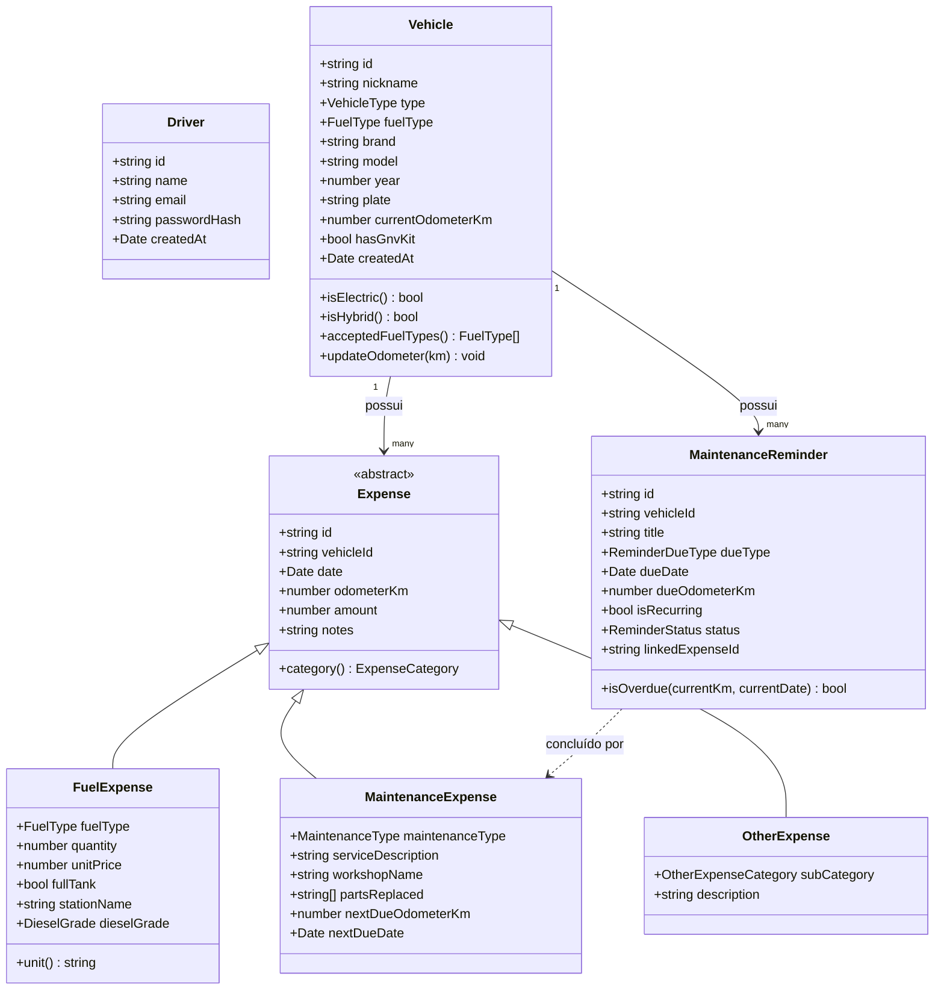

# Modelo de Domínio — AutoMobile

## Diagrama de classes

`Driver` não tem relacionamento com `Vehicle`/`Expense` no diagrama de
propósito: ele é só a trava de login local (MVP assume um único
motorista por instalação — ver regra 10). Se um dia o app precisar de
múltiplos motoristas por dispositivo, aí sim `Vehicle` ganha
`driverId`.

## Enums

| Enum                 | Valores                                                                 |
|-----------------------|--------------------------------------------------------------------------|
| `VehicleType`          | `CAR`, `MOTORCYCLE`, `PICKUP_TRUCK`, `SUV`, `VAN`, `OTHER`               |
| `FuelType`             | `GASOLINE`, `ETHANOL` (motor dedicado a álcool, não-flex), `FLEX` (bicombustível gasolina/etanol), `DIESEL`, `GNV`, `ELECTRIC`, `HYBRID`, `ARLA_32` |
| `DieselGrade`          | `S10`, `S500` (atributo opcional, só quando `fuelType = DIESEL`)        |
| `ExpenseCategory`      | `FUEL`, `MAINTENANCE`, `OTHER` (discriminador das subclasses de Expense) |
| `MaintenanceType`      | `PREVENTIVE`, `CORRECTIVE`                                               |
| `OtherExpenseCategory` | `INSURANCE`, `TAXES`, `CAR_WASH`, `PARKING`, `TOLL`, `FINE`, `ACCESSORY`, `DOCUMENTATION`, `OTHER` |
| `ReminderDueType`      | `BY_DATE`, `BY_ODOMETER`, `BOTH`                                         |
| `ReminderStatus`       | `PENDING`, `COMPLETED`, `OVERDUE`                                        |

## Regras de negócio principais

1. Um `Vehicle` nunca tem `currentOdometerKm` decrescente — só é
   atualizado para valores maiores ou iguais.
2. `FuelExpense.fuelType` deve estar em `Vehicle.acceptedFuelTypes()`: um
   veículo `ELECTRIC` só aceita `ELECTRIC`; um veículo `HYBRID` aceita
   `ELECTRIC` ou o tipo de combustão configurado; um veículo `GASOLINE`,
   `ETHANOL` ou `FLEX` com `hasGnvKit = true` também aceita `GNV`, além do
   seu `fuelType` de fábrica (kit de conversão bi/tricombustível — não
   troca o `fuelType` original do veículo).
3. `unit()` de um `FuelExpense` é `kWh` quando `fuelType = ELECTRIC`, e
   `L` (litros) para os demais.
4. Um `MaintenanceReminder` fica `OVERDUE` quando a data atual passa de
   `dueDate` (se `dueType` inclui `BY_DATE`) ou o hodômetro do veículo
   ultrapassa `dueOdometerKm` (se `dueType` inclui `BY_ODOMETER`).
5. Ao registrar uma `MaintenanceExpense` vinculada a um `MaintenanceReminder`
   pendente, o reminder passa para `COMPLETED` e guarda `linkedExpenseId`.
6. Consumo médio (`km/l` ou `km/kWh`) é calculado entre dois `FuelExpense`
   consecutivos do mesmo veículo com `fullTank = true`:
   `distância percorrida / quantidade abastecida na segunda medição`.
7. `dieselGrade` só pode ser definido quando `fuelType = DIESEL`; para
   qualquer outro `fuelType` (incluindo `ARLA_32`) o campo deve ficar vazio.
8. `FuelExpense` com `fuelType = ARLA_32` não entra no cálculo de consumo
   médio (regra 6) nem conta como abastecimento de combustível — é uma
   despesa própria, só compartilha a estrutura de registro (quantidade,
   preço unitário, posto) por ser comprado do mesmo jeito, por litro, no
   posto. Um veículo só aceita `ARLA_32` se for `DIESEL` (sistemas SCR são
   exclusivos de motores a diesel).
9. `hasGnvKit = true` só é válido quando `fuelType` do veículo é
   `GASOLINE`, `ETHANOL` ou `FLEX`. Um veículo dedicado a GNV de fábrica
   usa `fuelType = GNV` diretamente, sem precisar do kit.
10. `Driver.passwordHash` nunca guarda a senha em texto puro — é gerado
    por um `PasswordHasher` (salt + várias iterações, nunca hash de uma
    rodada só). `Driver.email` é único e normalizado (trim + lowercase)
    antes de salvar. Login (`AuthenticateDriver`) retorna a mesma
    mensagem de erro para e-mail inexistente e senha errada, pra não
    revelar se um e-mail está cadastrado.
